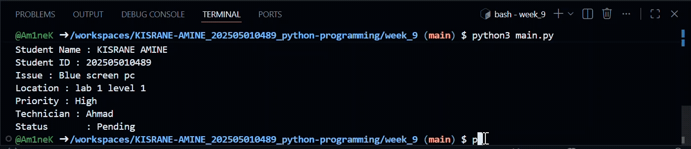

# IT Helpdesk Ticket Registraion System 

## Purpose
This program allows student to register IT helpdesk ticket for technical issues:

## Tech stack 
Python 3 
Modular programming 

## How to run 
python3 main.py

## Features 
Enter student information 
Enter issue descprition 
Select priority level
Automatically assign technician 
Display help ticket 

## Video demonstration 

